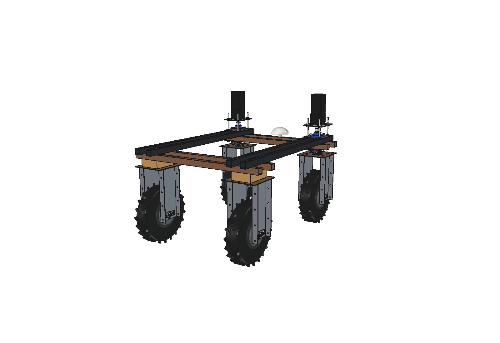
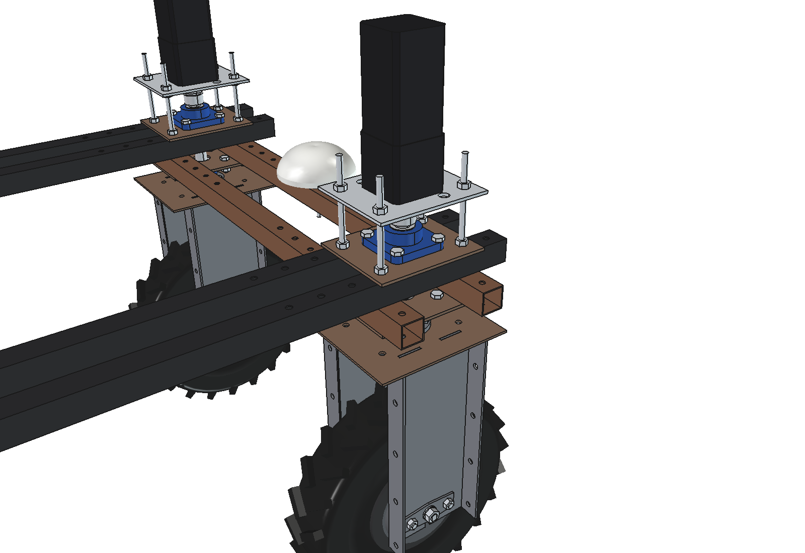
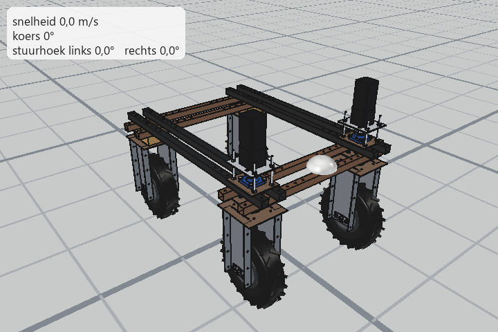

# Bruut OpenAgbot - FreeCAD model

FreeCAD 1.1 versie van het ontwerp: 2 vaste hubmotorwielen achter, 2 sturende hubmotorwielen voor met elk een
stappenmotor (NEMA34 + 5:1 planeetkast) erboven. Gebouwd uit de OpenSCAD-bestanden, de foto's in `Design real life/`
en de stappenmotorplaat `parts/PLOATIE 2.STP`.




## Bestanden

| Bestand | Inhoud |
| --- | --- |
| `Bruut_OpenAgbot.FCStd` | het model (openen in FreeCAD) |
| `agbot_params.py` | alle maten, zelfde namen en waarden als `config/parameters.scad`, plus de nieuwe stuurparameters |
| `agbot_parts.py` | een functie per fysiek onderdeel (zoals `parts/*.scad`) |
| `build_agbot.py` | zet de onderdelen in de boomstructuur, kleurt ze en slaat op |
| `run_in_freecad.py` | start-macro: open in FreeCAD en voer uit (F6), dan wordt het model opnieuw gegenereerd |
| `animate_agbot.py` | animatie rijden en draaien: kinematica, live afspelen in FreeCAD, frames renderen |
| `make_gif.py` | zet de gerenderde frames om naar een GIF (Pillow) |
| `previews/` | afbeeldingen (isometrisch, bovenaanzicht, zijaanzicht, achteraanzicht, stuurkop) en `animation_drive_turn.gif` |

Opnieuw genereren overschrijft het open document `Bruut_OpenAgbot` en `Bruut_OpenAgbot.FCStd`.
Pas maten aan in `agbot_params.py`, nooit in het FCStd-bestand zelf (die onderdelen zijn niet parametrisch).

## Assen

x = rechts, y = rijrichting (voor = +y), z = omhoog, grond = z 0. Wielmiddens op x = ±375, y = ±500, as op z = 215.
In FreeCAD's "Front"-weergave kijk je dus naar de achterkant van de robot; "Rear" toont de voorkant.

## Boomstructuur

```
Bruut_OpenAgbot_robot
  chassis_frame                  4 onderste balken (chassis_beam_1), 4 bovenste balken (chassis_beam_2), GNSS-antenne
  wheel_unit_rear_left / right   hubmotorwiel, wielbeugel, houten blok, boutwerk
  wheel_unit_front_left / right  stuurkop: lagerplaten, 2 flenslagers, stappenmotorplaat, stappenmotor, draadstangen
    steered_part_front_*         alles dat meedraait met het stuur: wiel, beugel, stuuras, koppeling
  optional_frame_cover_NOT_ON_PHOTOS   main_base_plate, upright_wall, protection_cover (verborgen)
```

## Sturen

Draai `steered_part_front_left` / `steered_part_front_right` (Placement, rotatie om z; + = naar links), of in de
Python-console:

```python
import build_agbot
build_agbot.set_steering(30, 22)
```

Binnenwiel scherper dan buitenwiel (Ackermann), zie ook `setup/information/steppermotor_information.json`.

## Animatie



De robot rijdt 1,2 m rechtuit (0 naar 1 m/s), stuurt naar links, draait 90° en rijdt weer rechtuit tot stilstand.
Kinematica: fietsmodel op het midden van de achteras. Elk voorwiel krijgt zijn eigen stuurhoek (Ackermann: bij 25°
middenhoek staat het binnenwiel op 29,5° en het buitenwiel op 21,6°, draaicirkel 2,1 m), alle wielen rollen zonder
slip af en de stuurmotoren draaien met 35°/s. Snelheid, hoeken en afstanden staan bovenaan `animate_agbot.py`.

Live afspelen in FreeCAD (het model `Bruut_OpenAgbot` moet open staan, de camera volgt de robot):

```python
import animate_agbot
animate_agbot.play()
animate_agbot.stop()
```

De GIF opnieuw maken (frames renderen in FreeCAD, daarna in een gewone terminal):

```python
animate_agbot.render_all(r"C:\temp\frames")
```

```
python make_gif.py C:\temp\frames previews\animation_drive_turn.gif 15
```

## Wat komt waar vandaan

**Exact uit OpenSCAD** (volume en afmetingen vergeleken met een OpenSCAD-STL-export: verschil < 0,01 %):
`bracket_top_plate`, `bracket_side_plate` (gebogen uitvoering), `axle_bracket`, `chassis_beam_1`, `chassis_beam_2`,
`main_base_plate`, `upright_wall`, `protection_cover`, positie van de wielen en de balken.
`PLOATIE 2` is parametrisch nagebouwd en heeft hetzelfde volume als het STEP-bestand (131 249,2 mm3).

**Afgeleid uit de foto's, maten geschat (aanpassen in `agbot_params.py`):**
- stuurkop: draaipuntflens op de top plate (4x M8, 50 x 50), stuuras O25, twee flenslagers (blauw, UCF205-maten) in
  platen onder en boven het frame, koppeling, 4 draadstangen M10 op het 150 x 100 patroon;
- stappenmotor + planeetkast (90 x 90 x 85 en 86 x 86 x 150), top van de motor op 1032 mm;
- `steering_gap` = 55 mm tussen top plate en onderste balken; achter vult een houten blok die ruimte;
- positie van de GNSS-antenne: midden, op de voorste dwarsbalk.

**Vervangers** (de STL's `hubmotor_quinder*.stl` en `tire_4.8_4.00-8.stl` staan niet in de repo): band 430 x 100 met
tractorprofiel, velg 8", motorhuis O160 x 140. Alle vier de wielen zijn gelijk, ook de voorste (op de foto's zitten
daar nog andere banden).

**Niet gemodelleerd:** kabels, trekhaak, label op de motor, afschuiningen op moeren.

## Aandachtspunten

- De optionele frame-onderdelen (uit `chassis_frame_asm.scad`) staan niet op de foto's en botsen met de rechter
  stuurkop (stappenmotor op x = 375, y = 500). Daarom verborgen.
- In OpenSCAD liggen de onderste balken 2 mm boven de top plate (`bracket_top_z` als plaatmidden). Hier liggen ze
  tegen de plaat of het houten blok.
- Controle op interferentie: geen overlap tussen de 80 zichtbare onderdelen.
